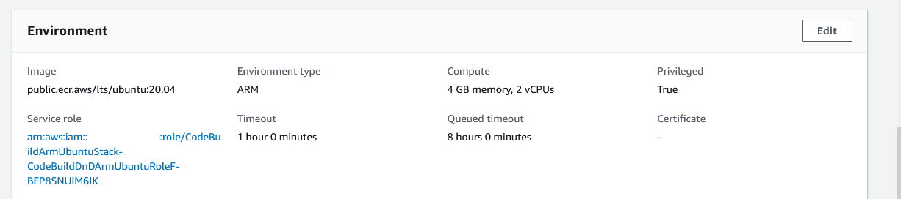
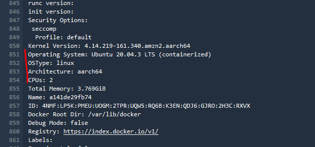
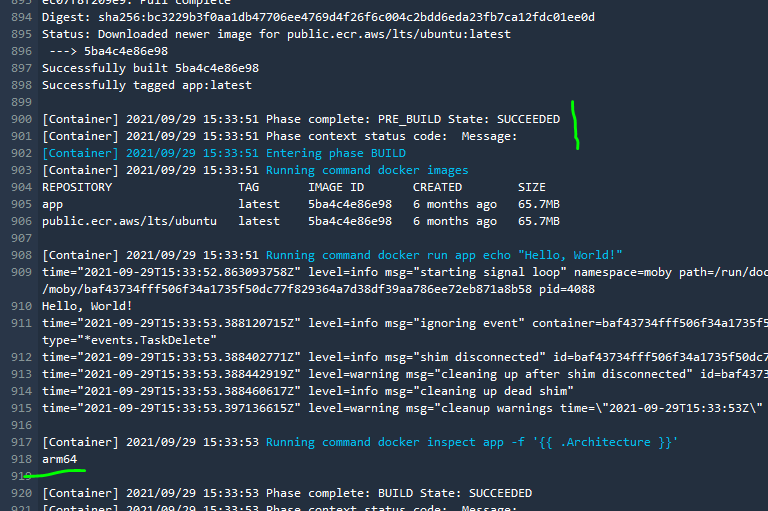

# Sample - Build Docker Images using Arm Ubuntu Image on AWS CodeBuild

This is a brief example of how to build a arm64 image on CodeBuild from a Ubuntu base image.

## What the build environment config looks like

## What the build env says when doing it's thing

## The resulting image is arm64

